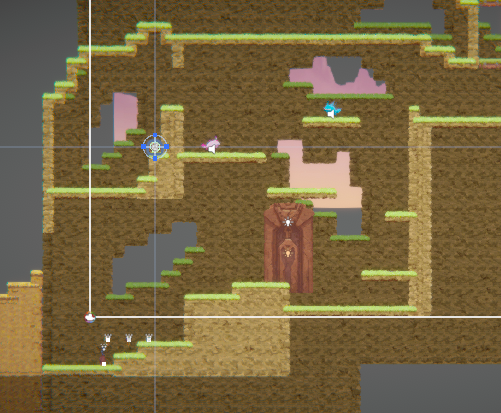

[](https://classroom.github.com/a/YyUO0xtt)
# COMP2150  - Level Design Document
### Name: [your name]
### Student number: [your student number] 

This document discusses and reflects on the design of your platformer level for the Level Design assessment. It should be 1500 words. Make sure you delete this and all other instructional text throughout the document before checking your word count prior to submission. Hint: You can check word count by copying this text into a Word or Google doc.

Your document must include images. To insert an image into your documentation, place it in the "DocImages" folder in this repo, then place the below text where you want the image to appear:

```

```

Example:


## 1. Player Experience (~700 words)
Outline and justify how your level design facilitates the core player experience goals outlined in the assignment spec. Each section should be supported by specific examples and screenshots of your game encounters that highlight design choices made to facilitate that particular experience.

### 1.1. Discovery
What does the player learn? How does your encounter and broader level design facilitate learning in a way that follows good design practice?

The player learns basic movement, enemies and mechanics during Section 1. Each encounter in Section 1 is designed to give the player a grasp on fundamental mechanics. Once the player reaches Section 2, they are free to apply and experiment what they have learnt at their own pace. Checkpoints are frequently given out to incentivize mistake-making, and health pickups reward mastery over the game. Encounters are split into sub-sections where the player takes them on individually, one at a time. This prevents the player from being overwhelmed or skipping multiple steps in learning.

### 1.2. Drama
What is the intensity curve? How does your design facilitate increasing yet modulating intensity, with moments of tension and relief? 


I wanted to make the intensity curve relax during Section 1, and increase steadily as the player traverses between sections 2 and 3. Section 1 should give the player some level of danger, but keep them at their own pace to learn the game's basic mechanics. Section's 2 and 3 play on risk and uncertainty to create tension on various subsections. For instance, some optional platforming sections challenge the player to take them for health packs, at the risk of losing HP should they make mistakes. 

Enemy placement is also considered with modulating intensity. I made use of Chompers and Spitters placed strategically on difficult to reach platforms. These serve as a stressor to the player by forcing them to make rash decisions on the fly. This is combined with some degree of uncertainty. Some sections of the level only partially show themselves, so the player is expected to improvise on various platforming sections.


Some areas are safe zones (denoted by checkpoints). These contain nothing harmful and allows the player room to process their next action or rest after an intense section of the map before repeating the tension process.


### 1.3. Challenge
What are the main challenges? How have you designed and balanced these challenges to control the difficulty curve and keep the player in the flow channel?

The main challenge comes from the precise manuvers needed to traverse certain sections, combined with patience and planning from the player on how they should approach a section. The level of difficulty starts out forgiving, but gradually increases as the player reaches Section 2. Difficult challenges are also accessible early on which reward the player with health pickups. Health pickups are limited outside of the optional sections. This helps the flow curve balance between moments of cautious platforming, and relief from sitting in safe areas/getting health pickups.

The use of acid and spikes has different purposes in increasing challenge. For instance, some areas had spikes in the ceiling to increase the precision needed by the player to jump at a right height without the risk of taking damage. Acid forces the player to restart a section of the level if they fall into it. I ensured that its use was limited to only shorter sections, as placing it in longer ones could break the player's flow state and cause frustration, especially when a great deal of progress was lost. Acid serves to challenge the player's mastery by ensuring they complete sections perfectly to receive a reward.

Later, the challenge is increased by adding more spitters. Spitters were the most dangerous enemy in the game due to their range. I decided to add few Chompers in the later sections as they felt trivial to manage with the gun. I relied on placing Spitters in hard to reach locations to pressure the player into completing the game's harder sections. This ensures they do not get bored and break out of the flow state from low difficulty.


### 1.4. Exploration
How does your level design facilitate autonomy and invite the player to explore? How do your aesthetic and layout choices create distinct and memorable spaces and/or places?

Taking inspiration from metroidvania games, I implemented a non-linear exploration system that held the player's hand at various points. Sections of the level allowed the player to split routes and pace themselves, while hand-holding sections have the routes combine to help the player progress in the right direction without getting lost.

I employed heavy use of pass-through platforms to facilitate backtracking. Backtracking was intentionally designed to be much easier. This encourages players to explore areas that they may have missed, and not make it tedious and mundane. Some areas showed "sneak peeks" of another area with the camera. While this does defeat the purpose of being hidden from the player, it plays on their curiousity to check out the shown area and encourages them to explore. 


Some subsections of a level were given distinct stand-out qualities to make the memorable. For instance, one level uses a mini-gauntlet that requires the player to clear 2 mini sections to open up a room that leads to a key. Later sections of the level uses the background tiles to ensure each subsection of the level stands out, or has distinct qualities to make them interesting.


I added some optional sections using health pickups to encourage the player to try them out. Health pickups on the main path were carefully placed to lead the player to the right direction to minimize the chances of getting lost in exploration. 

## 2. Core Gameplay (~400 words)
A section on Core Gameplay, where storyboards are used to outline how you introduce the player to each of the required gameplay elements in the first section of the game. Storyboards should follow the format provided in lectures.

Storyboards can be combined when multiple mechanics are introduced within a single encounter. Each section should include a sentence or two to briefly justify why you chose to introduce the mechanic/s to the player in that sequence.

You should restructure the headings below to match the order they appear in your level.


### 2.1. Acid
Acid is introduced before Section 2. They serve as a restart of a subsection should the player fail, and thus the player must plan carefully around them.

### 2.2. Checkpoints
Checkpoints are given generously, at least one within each subsection of the map so exploration is not exhausting for the player. They are placed before an obstacle, sometimes during one to add challenge to some sections of the level..

### 2.3. Chompers
Chompers are introduced as a peon enemy initially. Later, they serve as an incentive for the player to platform patiently, or with caution as they are placed on smaller platforms or serve as obstacles during exploration. 
### 2.4. Health Pickups
Health pickups are introduced via alternate paths in Section 1. I designed them to be items you can find as reward for exploration/completing an optional challenging section. They were also introduced to reward the player for completing a section of the level. Health packs used this way reward the player's exploration and curiousity, or serve as moments of relief after completing a difficult section.

### 2.5. Keys
Keys are not introduced in Section 1. However, the first and most accessible section (the key gauntlet) serves to pique the player's curiousity into collecting them.

### 2.6. Moving Platforms
Moving platforms were not introduced in Section 1. I decided to leave them for Section 2 as I wanted the player to grasp movement basics before approaching them.

### 2.7. Passthrough Platforms
Passthrough platforms are introduced during Section 1. It was essential for the player to grasp their mechanics as most platforming in the level was based on these platforms. I taught them both to descend and ascend a platform.

### 2.8. Spikes
Spikes are introduced as a constraint on the player's movement in platforming. These teach the player on movement in Section 1, and are later used to test their skill via precision platforming.

### 2.9. Spitters
Spitters are introduced in Section 1, which serve to pressure the player to move or process their actions before taking on a platformer section. They are first introduced by introducing their blindspot to players.


### 2.10. Weapon Pickup (Gun)
The gun is significantly stronger than the Staff, so I introduced it leading into Section 3. The gun serves as the player's primary option for dealing with Spitters, out of reach enemies or for shooting switches.  The player should have some grasp of the movement mechanics, so they can apply what they know to maxmize the gun's range.


### 2.11. Weapon Pickup (Staff)
I decided to introduce the Staff early into the game at Section 1, as the player would not have any agency against the enemies encounters I put in without it. 

## 3. Spatiotemporal Design
A section on Spatiotemporal Design, which includes your molecule diagram and annotated level maps (one for each main section of your level). These diagrams may be made digitally or by hand, but must not be created from screenshots of your game. The annotated level maps should show the structure you intend to build, included game elements, and the path the player is expected to take through the level. Examples of these diagrams are included in the level design lectures.

No additional words are necessary for this section (any words should only be within your images/diagrams).
 
### 3.1. Molecule Diagram

### 3.2. Level Map – Section 1


### 3.3.	Level Map – Section 2

### 3.4.	Level Map – Section 3
See above.

## 4. Iterative Design (~400 words)
Reflect on how iterative design helped to improve your level. Additional prototypes and design artefacts should be included to demonstrate that you followed an iterative design process (e.g. pictures of paper prototypes, early grey-boxed maps, additional storyboards of later gameplay sequences, etc.). You can also use this section to justify design changes made in Unity after you drew your level design maps shown in section 3. 

Originally, Section 1 was made to be much shorter, but I decided to add more platforming and teaching moments to ensure the player had the ropes with controls. This was essential before they were given the non-linear sections of the level.  


I also added more enemies within section 1 to reinforce the player's learning around their danger.



Section 2 and 3 contains some humps that force the player to converge at a location while proceeding through the map. These were used as aids to help the player navigate through each section without getting lost.


Background tiles were initially used as filler, but I decided to use them to help guide the player's movements. This also made the game more visually appealing and keeps areas unique enough to avoid cases of the player getting lost during map traversal. Moving platforms had the most potential for improvement through iteration, as there are many use cases that were not explored in my level. For instance, moving platforms that could be manually shifted around or moving platforms that fall into acid if stood on for too long. These could have been utilized during the later sections of the level.


You should conclude by highlighting a specific example of an encounter, or another aspect of your level design, that could be improved through further iterative design.

## Generative AI Use Acknowledgement

Use the below table to indicate any Generative AI or writing assistance tools used in creating your document. Please be honest and thorough in your reporting, as this will allow us to give you the marks you have earnt. Place any drafts or other evidence inside this repository. This form and related evidence do not count to your word count.
An example has been included. Please replace this with any actual tools, and add more as necessary.


### Tool Used: ChatGPT
**Nature of Use** Finding relevant design theory.

**Evidence Attached?** Screenshot of ChatGPT conversation included in the folder "GenAI" in this repo.

**Additional Notes:** I used ChatGPT to try and find some more relevant design theory that I could apply to my game. After googling them, however, I found most of them were inaccurate, and some didn't exist. One theory mentioned, however, was useful, and I've incorporated it into my work.

### Tool Used: Example
**Nature of Use** Example Text

**Evidence Attached?** Example Text

**Additional Notes:** Example Text


